#  AgroVision AI: Crop Disease Detection with Deep Learning

Projeto de **Deep Learning aplicado à agricultura** com foco na identificação automática de **doenças e pragas em culturas agrícolas**, utilizando imagens de folhas e plantas.

Atualmente, o projeto contempla modelos independentes para **milho** e **soja**, permitindo escalabilidade, manutenção simples e experimentação controlada via **MLflow**.

---

## Objetivo

Desenvolver uma solução baseada em **Redes Neurais Convolucionais (CNNs)** capaz de identificar doenças agrícolas a partir de imagens, apoiando a **tomada de decisão inteligente no campo**.

Com isso, o projeto busca:

* Reduzir o uso indiscriminado de defensivos agrícolas
* Diminuir custos operacionais para produtores
* Minimizar impactos ambientais
* Aumentar a eficiência no manejo das culturas

---

## Abordagem Técnica

* Modelos independentes por cultura (ex: milho e soja)
* Treinamento supervisionado com imagens rotuladas
* Arquiteturas CNN modernas (ResNet, EfficientNet, etc.)
* Experimentos rastreados com **MLflow**
* Pipeline preparado para produção via **FastAPI + Streamlit**

---

## 🗂️ Estrutura do Repositório

```
agro-disease-classification/
│
├── README.md
│
├── api/
|   ├── app/
|   |   └── main.py
|   |
|   ├── functions/
|   |   ├── model.py
|   |   ├── preprocessing.py
|   |   └── schema.py
|   |
|   ├── models/
|   |   ├── modelo_milho_doencas_pyfunc/
|   |   |   └── MLmodel
|   |   └── modelo_soja_doencas_pyfunc/
|   |       └── MLmodel
|   |
|   ├── src/
|   |   └── models/
|   |       └── milho_models.py
|   |
|   ├── requirements.txt
|   └── Dockerfile
|    
├── notebooks/
│   ├── milho/
│   │   ├── 01_data_preparation.ipynb
│   │   ├── 02_training_mlflow.ipynb
│   │   └── 03_evaluation.ipynb
│   │
│   └── soja/
│       ├── 01_data_preparation.ipynb
│       ├── 02_training_mlflow.ipynb
│       └── 03_evaluation.ipynb
│
└── src/
    ├── dataset/
    │   ├── milho_dataset.py
    │   └── soja_dataset.py
    |
    ├── models/
    │   ├── milho_model.py
    │   └── soja_model.py
    │
    ├── preprocessing/
    │   ├── milho_preprocessing.py
    │   └── soja_preprocessing.py
    │
    ├── train.py
    └── evaluate.py
```

---

## Treinamento e Experimentação dos Modelos — Cultura de Milho

Esta seção apresenta os experimentos realizados para classificação de doenças em folhas de milho utilizando modelos de visão computacional. O objetivo foi comparar diferentes arquiteturas e estratégias de treinamento, avaliando o comportamento das curvas de **acurácia**, **loss** e o desempenho final por meio das **matrizes de confusão**.

Foram avaliadas quatro arquiteturas:

- **Simple CNN** (Arquitetura criada do zero)
- **ResNet18**
- **DenseNet**
- **EfficientNet**

Cada modelo foi treinado em dois cenários:

- **Learning Rate Fixo**: taxa de aprendizado constante durante todo o treinamento.
- **One Cycle Policy**: estratégia dinâmica de ajuste do learning rate ao longo das épocas, permitindo maior exploração inicial e refinamento ao final do treinamento.

As classes avaliadas foram:

- **Blight**
- **Common Rust**
- **Gray Leaf Spot**
- **Healthy**

---

## 1. Experimentos com Learning Rate Fixo

Nesta primeira etapa, os modelos foram treinados utilizando um valor fixo de learning rate, otimizado pelo `Learning Rate Finder`. Essa abordagem serve como baseline para avaliar o comportamento inicial das arquiteturas sem variação dinâmica da taxa de aprendizado.

### 1.1 Acurácia de Treinamento — Learning Rate Fixo

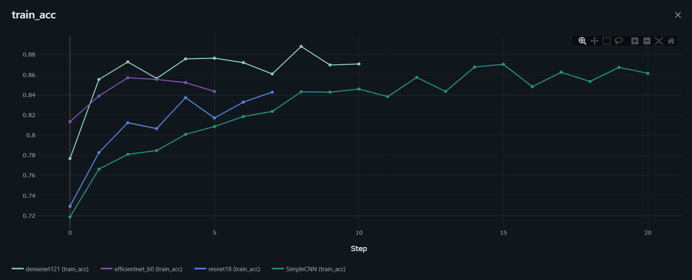

A curva de acurácia em treino mostra que todos os modelos conseguiram aprender padrões relevantes das imagens ao longo das épocas. As arquiteturas pré-treinadas, como **ResNet18**, **DenseNet** e **EfficientNet**, apresentaram boa evolução, mas com algumas oscilações. A **Simple CNN**, mesmo sendo uma arquitetura mais simples, demonstrou crescimento consistente, indicando boa capacidade de aprendizado para o conjunto de dados utilizado.

### 1.2 Loss de Treinamento — Learning Rate Fixo

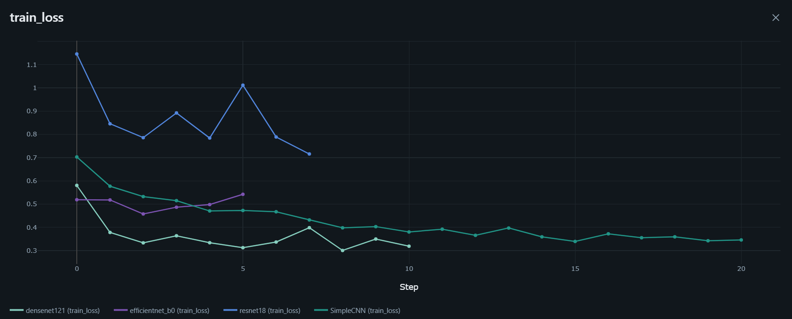

A redução da loss de treino indica que os modelos foram capazes de minimizar o erro durante o aprendizado. No entanto, o comportamento das curvas sugere que o uso de um learning rate fixo pode limitar a estabilidade da otimização em alguns modelos, principalmente nas arquiteturas mais profundas, que tendem a ser mais sensíveis à escolha da taxa de aprendizado.

### 1.3 Acurácia de Validação — Learning Rate Fixo

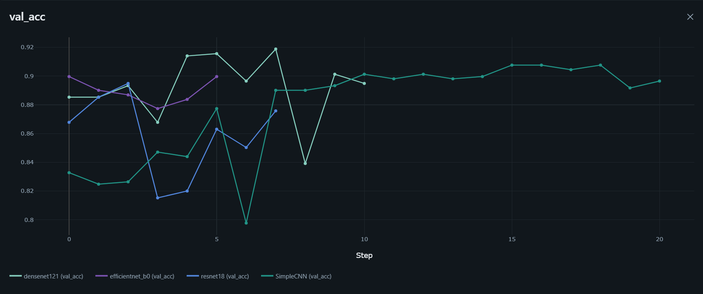

Na validação, observa-se que os modelos apresentaram desempenho competitivo, mas com maior instabilidade em comparação ao treino. As oscilações indicam que, embora os modelos tenham aprendido bem nos dados de treinamento, a generalização para dados não vistos foi mais sensível à estratégia de otimização utilizada.

### 1.4 Loss de Validação — Learning Rate Fixo

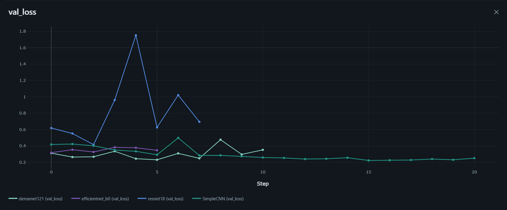

A loss de validação apresenta variações ao longo das épocas, reforçando que o learning rate fixo não foi a estratégia mais estável para todos os modelos. Picos na loss indicam momentos em que o modelo perdeu capacidade de generalização, mesmo que a acurácia final ainda tenha permanecido em níveis satisfatórios.

---

## 2. Experimentos com One Cycle Policy

Na segunda etapa, os modelos foram treinados utilizando **One Cycle Policy**, uma técnica que ajusta dinamicamente o learning rate durante o treinamento. A ideia é permitir que o modelo explore melhor o espaço de soluções no início e refine os pesos nas épocas finais.

### 2.1 Acurácia de Treinamento — One Cycle Policy

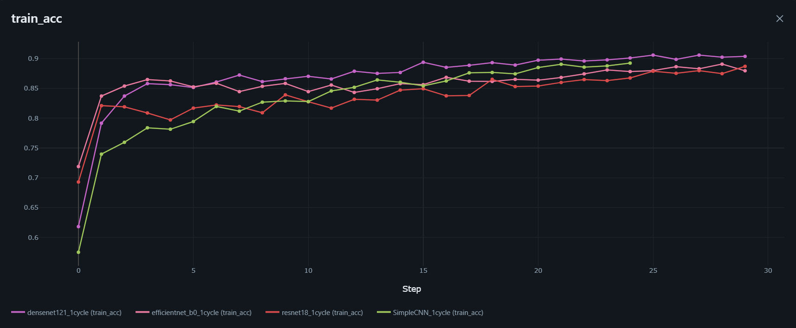

Com a One Cycle Policy, as curvas de acurácia em treino apresentaram evolução consistente. Essa estratégia favoreceu uma convergência mais eficiente, permitindo que os modelos atingissem bons resultados sem depender de um learning rate fixo durante todo o processo.

### 2.2 Loss de Treinamento — One Cycle Policy

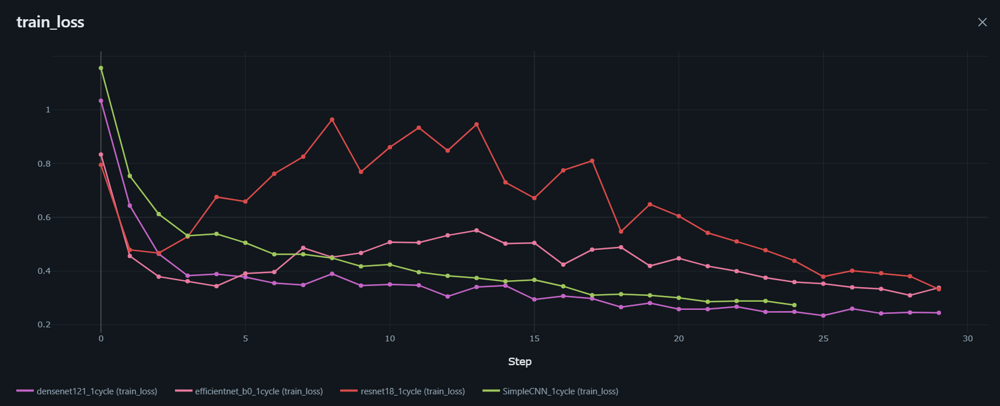

A curva de loss em treino apresentou queda progressiva, evidenciando que a variação dinâmica do learning rate contribuiu para um processo de otimização mais controlado. Em comparação ao learning rate fixo, a One Cycle Policy mostrou maior capacidade de reduzir o erro de forma eficiente.

### 2.3 Acurácia de Validação — One Cycle Policy

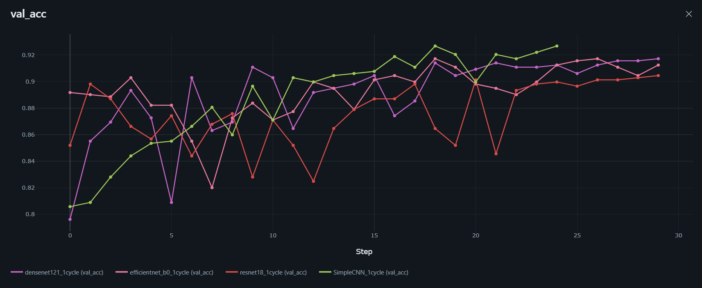

Na validação, a One Cycle Policy apresentou desempenho superior na maior parte dos experimentos. Os modelos demonstraram melhor capacidade de generalização, com destaque para a **Simple CNN**, que apresentou o melhor equilíbrio entre aprendizado, estabilidade e desempenho final.

### 2.4 Loss de Validação — One Cycle Policy

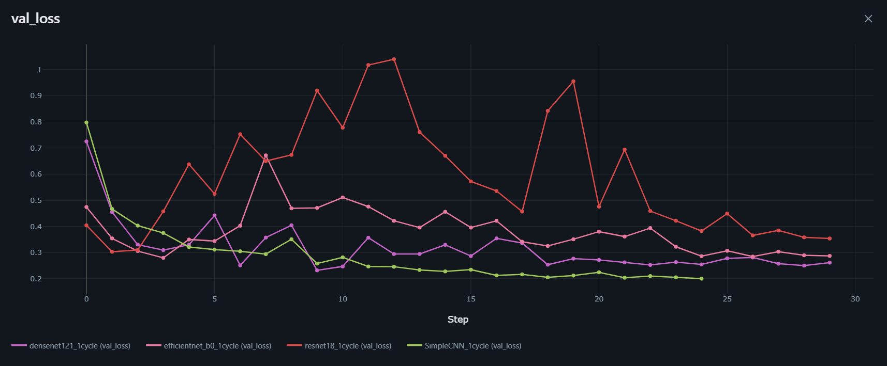

A loss de validação com One Cycle apresentou comportamento mais competitivo em relação ao learning rate fixo. Apesar de ainda existirem oscilações pontuais, os modelos demonstraram melhor ajuste aos dados de validação, indicando que a estratégia dinâmica de learning rate contribuiu para maior estabilidade no treinamento.

---

## 3. Análise das Matrizes de Confusão

As matrizes de confusão foram utilizadas para avaliar o desempenho dos modelos por classe. Essa análise é essencial porque a acurácia geral pode esconder dificuldades específicas, como confusões entre doenças visualmente semelhantes.

O principal desafio observado foi a diferenciação entre **Blight** e **Gray Leaf Spot**, classes que apresentaram maior nível de confusão entre si. Já as classes **Common Rust** e **Healthy** foram classificadas com maior consistência na maioria dos experimentos.

---

## 3.1 Simple CNN

### Simple CNN — Learning Rate Fixo


A **Simple CNN** com learning rate fixo apresentou bom desempenho geral, principalmente na identificação da classe **Healthy**. Entretanto, ocorreram confusões entre **Blight** e **Gray Leaf Spot**, indicando dificuldade do modelo em separar doenças com características visuais parecidas.

### Simple CNN — One Cycle Policy


Com a One Cycle Policy, a **Simple CNN** apresentou o melhor resultado geral entre os experimentos. Houve melhora na classificação de **Blight** e redução dos erros em relação à versão com learning rate fixo. O modelo também manteve excelente desempenho na classe **Healthy**, demonstrando bom equilíbrio entre simplicidade, estabilidade e capacidade de generalização.

---

## 3.2 ResNet18

### ResNet18 — Learning Rate Fixo

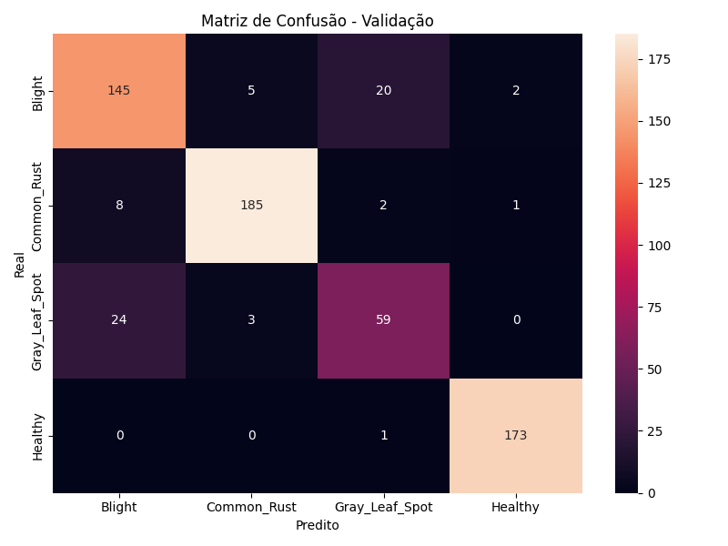

A **ResNet18** com learning rate fixo teve desempenho consistente, especialmente nas classes **Common Rust** e **Healthy**. Porém, ainda apresentou erros relevantes entre **Blight** e **Gray Leaf Spot**, o que impactou o desempenho geral do modelo.

### ResNet18 — One Cycle Policy


Com One Cycle, a **ResNet18** apresentou melhora em algumas classes, mas ainda manteve confusões importantes entre doenças visualmente próximas. Apesar da evolução em relação ao learning rate fixo, o modelo não superou a Simple CNN em equilíbrio geral entre as classes.

---

## 3.3 DenseNet

### DenseNet — Learning Rate Fixo


A **DenseNet** com learning rate fixo apresentou bons resultados para **Common Rust** e **Healthy**, mas teve maior dificuldade na diferenciação entre **Blight** e **Gray Leaf Spot**. Essa confusão reduziu sua performance geral na validação.

### DenseNet — One Cycle Policy


Com One Cycle, a **DenseNet** apresentou melhora em relação à versão com learning rate fixo, especialmente na redução de erros em algumas classes. Ainda assim, manteve confusões entre **Blight** e **Gray Leaf Spot**, mostrando que a técnica melhorou o treinamento, mas não eliminou completamente o principal desafio do problema.

---

## 3.4 EfficientNet

### EfficientNet — Learning Rate Fixo

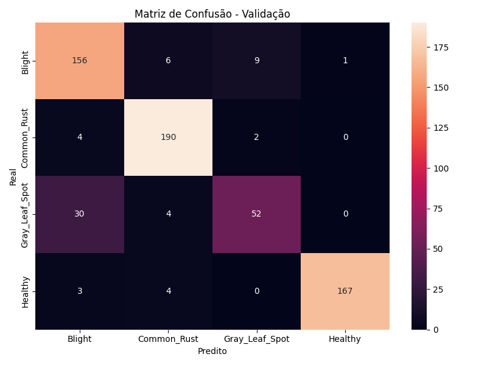

A **EfficientNet** com learning rate fixo apresentou bom desempenho geral, com classificações consistentes em **Blight**, **Common Rust** e **Healthy**. A maior dificuldade permaneceu na classe **Gray Leaf Spot**, que foi confundida principalmente com **Blight**.

### EfficientNet — One Cycle Policy

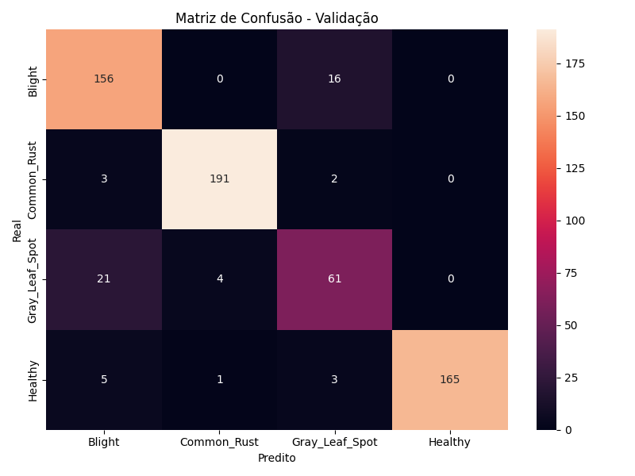

Com One Cycle, a **EfficientNet** apresentou melhora na classificação de **Gray Leaf Spot**, reduzindo parte dos erros observados no treinamento com learning rate fixo. O modelo ficou entre os melhores resultados gerais, embora ainda tenha apresentado desempenho inferior à **Simple CNN com One Cycle** no critério final de seleção.

---

## 4. Comparação Geral dos Experimentos

| Modelo | Estratégia de treinamento | Desempenho observado | Principais pontos positivos | Principal limitação |
|---|---|---|---|---|
| Simple CNN | Learning Rate Fixo | Bom desempenho geral | Simplicidade e boa classificação de Healthy | Confusão entre Blight e Gray Leaf Spot |
| Simple CNN | One Cycle Policy | Melhor resultado geral | Melhor equilíbrio entre classes e maior estabilidade | Ainda apresenta pequenas confusões entre doenças semelhantes |
| ResNet18 | Learning Rate Fixo | Desempenho consistente | Boa classificação de Common Rust e Healthy | Menor equilíbrio entre Blight e Gray Leaf Spot |
| ResNet18 | One Cycle Policy | Melhora parcial | Melhor ajuste em algumas classes | Não superou a Simple CNN em desempenho geral |
| DenseNet | Learning Rate Fixo | Resultado competitivo | Boa classificação de classes mais distintas | Maior dificuldade em Gray Leaf Spot |
| DenseNet | One Cycle Policy | Melhora em relação ao LR fixo | Redução de alguns erros por classe | Persistência de confusão entre doenças próximas |
| EfficientNet | Learning Rate Fixo | Bom desempenho geral | Forte capacidade de classificação | Dificuldade em Gray Leaf Spot |
| EfficientNet | One Cycle Policy | Entre os melhores resultados | Melhor equilíbrio que sua versão com LR fixo | Ainda abaixo da Simple CNN com One Cycle |

De forma geral, a **One Cycle Policy** apresentou desempenho superior ao learning rate fixo na maior parte dos experimentos. A técnica contribuiu para maior estabilidade nas curvas de treinamento e validação, além de melhorar o desempenho em classes com maior dificuldade de classificação.

O resultado mais relevante foi que uma arquitetura mais simples, a **Simple CNN**, conseguiu superar modelos mais complexos quando treinada com One Cycle Policy. Isso indica que, para este conjunto de dados, uma arquitetura menor e bem otimizada foi suficiente para capturar os padrões visuais necessários para a classificação das doenças do milho.

---

## 5. Critério de Seleção do Melhor Modelo

A escolha do melhor modelo foi baseada nos critérios utilizados durante a etapa de treinamento e avaliação:

1. **Maior desempenho no conjunto de validação**;
2. **Menor quantidade de erros na matriz de confusão**;
3. **Melhor equilíbrio entre as classes**;
4. **Menor confusão entre doenças visualmente semelhantes**;
5. **Estabilidade das curvas de accuracy e loss**;
6. **Boa capacidade de generalização**;
7. **Score Calculado:** 

    score = val_acc - 0.1 * val_loss

    Essa abordagem permite:

    - Priorizar modelos com alta acurácia
    - Penalizar modelos com baixa confiança (loss elevada).

    | Rank | Modelo | Learning Rate | One Cycle | Épocas | Train Acc | Val Acc | Train Loss | Val Loss | Score |
    |---:|---|---:|:---:|---:|---:|---:|---:|---:|---:|
    | 1 | SimpleCNN | 0.001485 | Sim | 25 | 0.8924 | 0.9268 | 0.2735 | 0.2008 | 0.9067 |
    | 2 | DenseNet121 | 0.005462 | Sim | 30 | 0.9037 | 0.9172 | 0.2445 | 0.2619 | 0.8910 |
    | 3 | EfficientNet-B0 | 0.012328 | Sim | 30 | 0.8794 | 0.9124 | 0.3381 | 0.2873 | 0.8837 |
    | 4 | SimpleCNN | 0.001485 | Não | 30 | 0.8617 | 0.8965 | 0.3455 | 0.2500 | 0.8715 |
    | 5 | ResNet18 | 0.027186 | Sim | 30 | 0.8870 | 0.9045 | 0.3324 | 0.3543 | 0.8690 |
    | 6 | EfficientNet-B0 | 0.012328 | Não | 30 | 0.8436 | 0.8997 | 0.5421 | 0.3460 | 0.8651 |
    | 7 | DenseNet121 | 0.005462 | Não | 30 | 0.8709 | 0.8949 | 0.3190 | 0.3515 | 0.8598 |
    | 8 | ResNet18 | 0.027186 | Não | 30 | 0.8429 | 0.8758 | 0.7156 | 0.6945 | 0.8064 |

Com base nesses critérios, o modelo selecionado foi:

> **Simple CNN treinada com One Cycle Policy**

Que possui as seguintes métricas de acordo com o classification report:

| Classe | Precision | Recall | F1-score | Support |
|---|---:|---:|---:|---:|
| Blight | 0.82 | 0.92 | 0.87 | 172 |
| Common Rust | 0.98 | 0.93 | 0.96 | 196 |
| Gray Leaf Spot | 0.80 | 0.71 | 0.75 | 86 |
| Healthy | 1.00 | 1.00 | 1.00 | 175 |
|-|-|-|-|-|
| **Accuracy** |  |  | **0.92** | **629** |
| **Macro Avg** | **0.90** | **0.89** | **0.89** | **629** |
| **Weighted Avg** | **0.92** | **0.92** | **0.92** | **629** |


A **Simple CNN com One Cycle** apresentou o melhor equilíbrio entre desempenho, estabilidade e simplicidade. Mesmo sendo menos complexa que arquiteturas como ResNet18, DenseNet e EfficientNet, ela obteve melhor resultado geral na validação, manteve boa consistência entre as classes e apresentou menor quantidade de erros na matriz de confusão.

Além disso, a utilização da **One Cycle Policy** contribuiu para melhorar a convergência do modelo, reduzindo a dependência de um learning rate fixo e favorecendo uma otimização mais eficiente ao longo das épocas.

Portanto, para os experimentos realizados com a cultura de milho, a combinação **Simple CNN + One Cycle Policy** foi considerada a melhor escolha para o modelo final.

---

## Treinamento e experimentação dos modelos — Soja

Esta etapa teve como objetivo comparar o desempenho de diferentes arquiteturas de redes neurais para classificação de doenças em folhas de soja. Assim como nos experimentos com milho, foram avaliadas duas estratégias de treinamento:

- **Learning rate fixo**, mantendo a taxa de aprendizado constante durante o treinamento;
- **One Cycle Policy**, utilizando uma taxa de aprendizado dinâmica ao longo das épocas.

Foram comparadas quatro arquiteturas principais:

- **CNN Simples**
- **ResNet18**
- **DenseNet121**
- **EfficientNet-B0**

A avaliação foi feita com base nas curvas de **acurácia**, **loss de treino**, **loss de validação** e nas **matrizes de confusão**.

#### Tratamento de Overfitting

Durante a fase de validação do modelo de soja, identificamos um cenário de overfitting (sobreajuste). O problema foi detectado ao submeter o modelo a um dataset de teste externo, previamente limpo e normalizado, onde a performance foi significativamente inferior aos dados de treino.Para mitigar esse problema e melhorar a generalização do modelo, aplicamos as seguintes estratégias:

Ajuste de Hiperparâmetros: Refinamos a taxa de aprendizado (LR ou Learning Rate) para permitir uma convergência mais estável e evitar que o modelo ficasse "preso" em mínimos locais de ruído dos dados de treino. 

Data Augmentation Estratégico: 

    Classes Minoritárias: Aplicamos um aumento agressivo de dados (rotações, flips, ajustes de brilho e contraste) para equilibrar a representatividade dessas classes.
    Classes Majoritárias: Reduzimos drasticamente o volume de dados e a intensidade das transformações para evitar que o modelo se tornasse tendencioso (bias) para as classes com mais amostras.
    Validação Cruzada: O loop de teste foi reestruturado para garantir que a normalização dos dados de produção fosse idêntica à do treinamento.

---

## 1. Experimentos com Learning Rate Fixo

### 1.1 Acurácia no treinamento

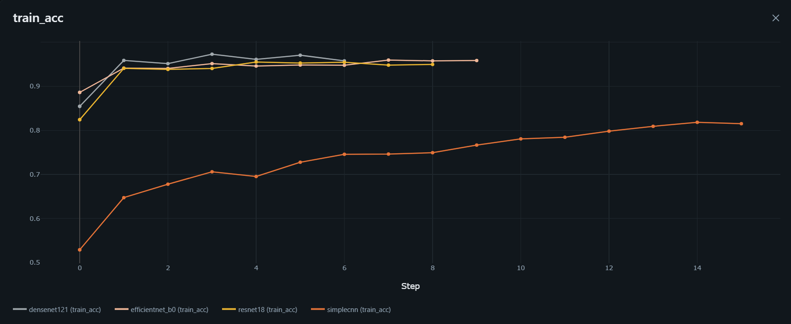

Com learning rate fixo, os modelos pré-treinados apresentaram evolução rápida e estável na acurácia de treino, alcançando níveis altos logo nas primeiras épocas. A **CNN Simples** evoluiu de forma mais lenta em comparação com as arquiteturas pré-treinadas, indicando menor capacidade de extração de características complexas quando treinada sem transferência de aprendizado.

Esse comportamento mostra que os modelos como **ResNet18**, **DenseNet121** e **EfficientNet-B0** aproveitaram melhor os padrões visuais da base, principalmente por já partirem de representações aprendidas previamente.

---

### 1.2 Loss no treinamento

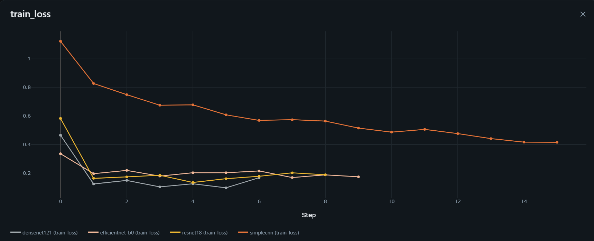

A loss de treino caiu de forma mais consistente nos modelos pré-treinados. A **CNN Simples** apresentou uma redução mais lenta, mantendo valores mais altos durante boa parte do treinamento.

Esse resultado reforça que, para a base de soja, as arquiteturas com transfer learning conseguiram ajustar os pesos com maior eficiência, enquanto a CNN Simples exigiu mais esforço para aprender padrões discriminativos.

---

### 1.3 Acurácia na validação

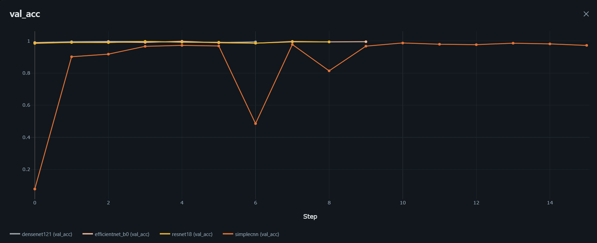

Na validação, os modelos pré-treinados apresentaram desempenho muito alto e estável. A **EfficientNet-B0** e a **ResNet18** se destacaram por manterem acurácia elevada ao longo das épocas.

A **CNN Simples** apresentou maior oscilação na validação, o que indica menor estabilidade de generalização em comparação com os modelos pré-treinados.

---

### 1.4 Loss na validação

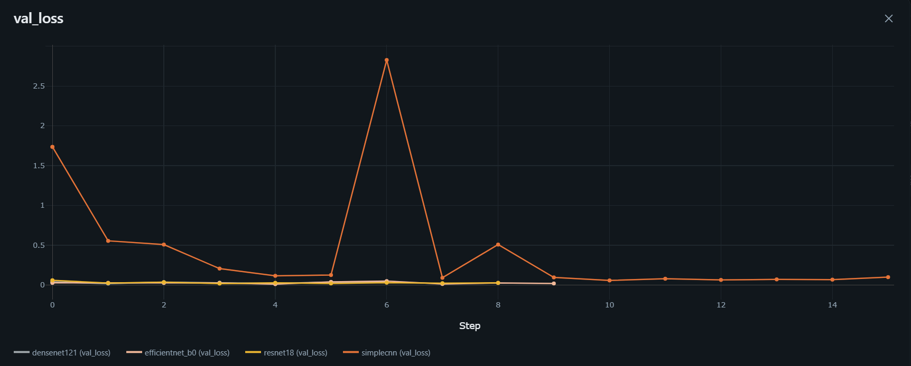

A loss de validação dos modelos pré-treinados permaneceu baixa e relativamente estável. A **CNN Simples**, por outro lado, apresentou oscilações mais fortes, incluindo picos de loss durante o treinamento.

Esse comportamento indica que, embora a CNN Simples consiga aprender parte dos padrões da base, sua generalização é menos estável quando comparada às arquiteturas mais robustas.

---

## 2. Experimentos com One Cycle Policy

### 2.1 Acurácia no treinamento

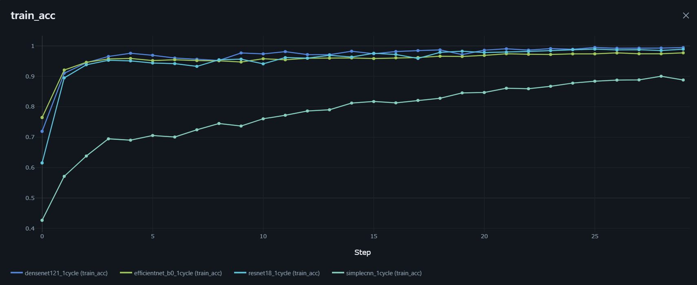

Com One Cycle Policy, os modelos apresentaram evolução consistente da acurácia de treino. Os modelos pré-treinados mantiveram desempenho superior durante praticamente todo o treinamento.

A **EfficientNet-B0** apresentou crescimento mais gradual, enquanto **DenseNet121** e **ResNet18** alcançaram rapidamente altos níveis de acurácia. A CNN Simples também evoluiu bem, mas permaneceu abaixo dos modelos pré-treinados.

---

### 2.2 Loss no treinamento

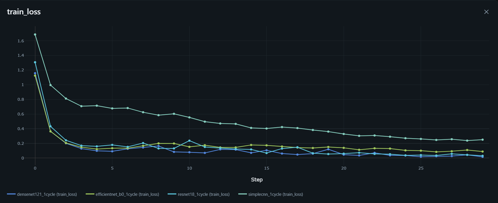

A loss de treino com One Cycle apresentou redução progressiva na maior parte dos modelos. A estratégia permitiu uma otimização mais dinâmica, principalmente nos modelos pré-treinados.

A **EfficientNet-B0** manteve loss mais alta no início, mas reduziu gradualmente ao longo das épocas. Isso sugere que o modelo precisou de mais tempo para estabilizar o aprendizado sob a política dinâmica de learning rate.

---

### 2.3 Acurácia na validação

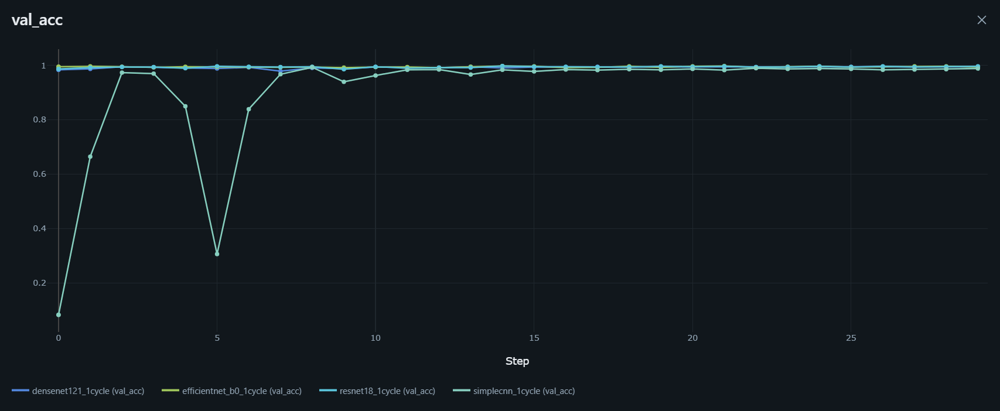

Na validação, os modelos mantiveram acurácia elevada. A maior parte das arquiteturas apresentou desempenho estável, mas a **EfficientNet-B0** teve oscilações mais evidentes nas primeiras épocas antes de estabilizar.

A One Cycle Policy contribuiu para bons resultados gerais, mas, neste caso, o ganho em relação ao learning rate fixo não foi tão claro quanto nos experimentos com milho.

---

### 2.4 Loss na validação

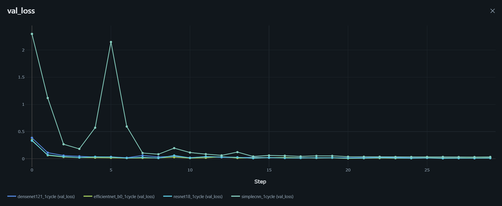

A loss de validação com One Cycle mostra que alguns modelos apresentaram instabilidade no início do treinamento, principalmente a **EfficientNet-B0**, com picos mais altos nas primeiras épocas.

Apesar disso, ao final do treinamento, a maioria dos modelos apresentou queda e estabilização da loss, indicando boa capacidade de generalização.

---

## 3. Análise das matrizes de confusão

As matrizes de confusão foram utilizadas para avaliar os erros específicos entre as classes, especialmente porque a base apresenta forte concentração na classe **Soja_Saudavel**. Por isso, além da acurácia geral, foi importante observar se os modelos estavam classificando corretamente as classes minoritárias.

As classes avaliadas foram:

- **Crestamento**
- **Ferrugem**
- **Mancha_Parda**
- **Mosaico_Amarelo**
- **Oidio**
- **Podridao_Sul**
- **Queima_Bacteriana**
- **Septoriose**
- **Sindrome_Morte_Subita**
- **Soja_Saudavel**
- **Virus_Mosaico**

---

### 3.1 CNN Simples — Learning Rate Fixo


A CNN Simples com learning rate fixo apresentou bom desempenho geral, principalmente na classe **Soja_Saudavel**, mas teve erros em classes minoritárias como **Mancha_Parda**, **Podridao_Sul** e algumas confusões envolvendo **Queima_Bacteriana** e **Mosaico_Amarelo**.

O resultado mostra que a arquitetura conseguiu aprender padrões relevantes, mas teve menor estabilidade nas classes com menor quantidade de exemplos.

---

### 3.2 CNN Simples — One Cycle


Com One Cycle, a CNN Simples apresentou leve melhora geral em relação ao learning rate fixo. Houve ganho na classificação de **Mancha_Parda** e a classe **Soja_Saudavel** foi classificada corretamente em todas as amostras.

Apesar disso, ainda ocorreram erros em classes como **Podridao_Sul**, **Ferrugem**, **Septoriose** e **Oidio**, indicando que a CNN Simples ainda possui limitações para separar algumas doenças visualmente semelhantes.

---

### 3.3 DenseNet121 — Learning Rate Fixo


A DenseNet121 com learning rate fixo apresentou desempenho muito forte, com poucos erros totais. A maioria das classes foi classificada corretamente, incluindo **Soja_Saudavel**, **Mancha_Parda**, **Mosaico_Amarelo**, **Queima_Bacteriana** e **Sindrome_Morte_Subita**.

Os erros ficaram concentrados em poucas classes, como **Ferrugem**, **Oidio**, **Podridao_Sul** e **Septoriose**.

---

### 3.4 DenseNet121 — One Cycle

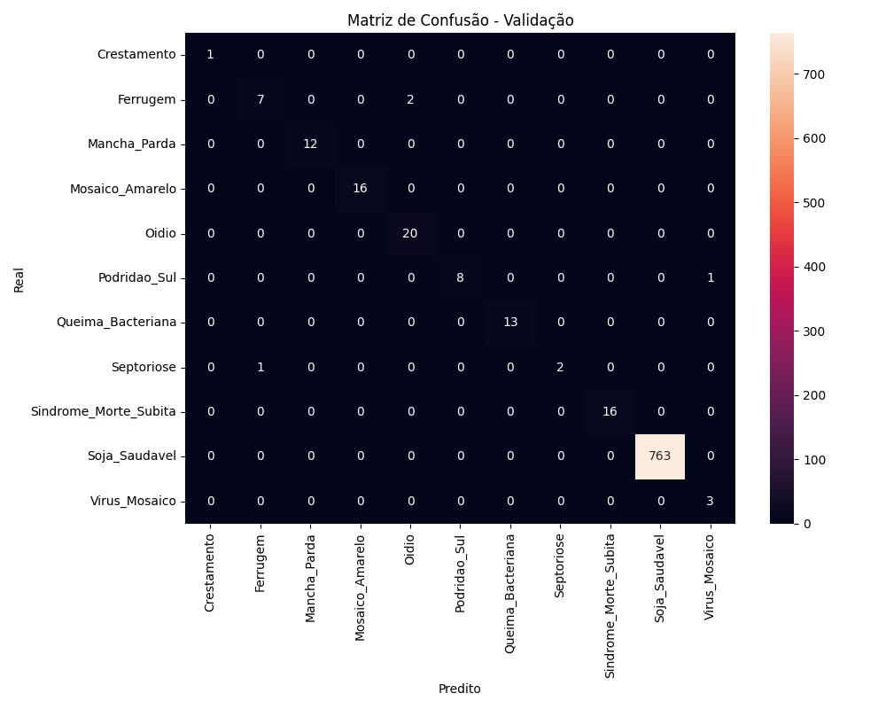

Com One Cycle, a DenseNet121 manteve desempenho muito próximo ao cenário com learning rate fixo. O modelo continuou classificando corretamente a maior parte das classes, com poucos erros concentrados em **Ferrugem**, **Podridao_Sul** e **Septoriose**.

Neste caso, a One Cycle Policy não trouxe uma melhora expressiva em relação ao LR fixo, mas manteve o modelo competitivo e estável.

---

### 3.5 EfficientNet-B0 — Learning Rate Fixo


A EfficientNet-B0 com learning rate fixo apresentou o melhor desempenho geral entre os experimentos. A matriz de confusão mostra apenas poucos erros, com acertos quase perfeitos nas classes minoritárias e classificação correta de todas as amostras da classe **Soja_Saudavel**.

Os erros ficaram restritos a casos pontuais, como **Mosaico_Amarelo** confundido com **Oidio** e **Septoriose** confundida com **Ferrugem**.

---

### 3.6 EfficientNet-B0 — One Cycle


Com One Cycle, a EfficientNet-B0 manteve desempenho alto, mas apresentou mais erros do que na versão com learning rate fixo. Houve pequenas confusões envolvendo **Ferrugem**, **Mosaico_Amarelo**, **Oidio**, **Podridao_Sul** e **Septoriose**.

Apesar disso, o modelo continuou com excelente capacidade de generalização e bom desempenho nas classes majoritárias e minoritárias.

---

### 3.7 ResNet18 — Learning Rate Fixo


A ResNet18 com learning rate fixo também apresentou excelente desempenho, ficando entre os melhores modelos. O modelo classificou corretamente quase todas as classes, com erros pontuais em **Mosaico_Amarelo**, **Septoriose** e **Virus_Mosaico**.

Esse resultado mostra que a ResNet18 teve boa capacidade de generalização, mesmo com uma arquitetura mais simples que DenseNet121 e EfficientNet-B0.

---

### 3.8 ResNet18 — One Cycle


Com One Cycle, a ResNet18 manteve desempenho muito alto e apresentou boa estabilidade entre as classes. A matriz mostra poucos erros, principalmente em **Ferrugem**, **Mancha_Parda** e **Mosaico_Amarelo**.

O desempenho final ficou muito próximo ao da versão com learning rate fixo, indicando que a arquitetura foi robusta nos dois cenários.

---

## 4. Comparação geral dos resultados

| Modelo | Estratégia de treinamento | Desempenho observado | Principais pontos positivos | Principal limitação |
|---|---|---|---|---|
| Simple CNN | Learning Rate Fixo | Bom desempenho geral | Arquitetura simples, treinamento mais leve e boa capacidade de aprendizado inicial | Menor estabilidade em comparação com sua versão usando One Cycle |
| Simple CNN | One Cycle Policy | Melhor desempenho entre as versões da Simple CNN | Maior estabilidade nas curvas e melhora na generalização | Ainda pode apresentar confusões pontuais entre classes visualmente semelhantes |
| ResNet18 | Learning Rate Fixo | Desempenho competitivo | Boa capacidade de extração de padrões visuais por meio de transfer learning | Curvas menos estáveis e menor desempenho em relação às melhores arquiteturas |
| ResNet18 | One Cycle Policy | Melhora parcial em relação ao LR fixo | Ajuste mais eficiente durante o treinamento e melhor controle da otimização | Não apresentou o melhor equilíbrio geral entre as classes |
| DenseNet121 | Learning Rate Fixo | Resultado consistente | Boa capacidade de reaproveitamento de características por conexões densas | Maior dificuldade de generalização em comparação com sua versão usando One Cycle |
| DenseNet121 | One Cycle Policy | Entre os melhores resultados gerais | Melhor estabilidade e desempenho superior ao LR fixo | Ainda pode apresentar erros em classes com padrões visuais próximos |
| EfficientNet-B0 | Learning Rate Fixo | Bom desempenho geral | Arquitetura eficiente e boa relação entre complexidade e desempenho | Menor estabilidade quando treinada com learning rate constante |
| EfficientNet-B0 | One Cycle Policy | Resultado mais competitivo entre os modelos pré-treinados | Melhor equilíbrio entre desempenho, estabilidade e generalização | Ainda exige maior custo computacional que a Simple CNN |

De forma geral, a **One Cycle Policy** apresentou desempenho superior ao learning rate fixo na maior parte dos experimentos. A variação dinâmica da taxa de aprendizado contribuiu para uma otimização mais eficiente, melhorando a estabilidade das curvas de treinamento e validação e favorecendo a capacidade de generalização dos modelos.

Nos experimentos com a cultura da **soja**, os modelos pré-treinados apresentaram desempenho competitivo, principalmente quando combinados com a **One Cycle Policy**. Esse comportamento mostra que arquiteturas como **DenseNet121**, **ResNet18** e **EfficientNet-B0** conseguem aproveitar bem os padrões visuais aprendidos previamente, adaptando-os ao problema de classificação de doenças em folhas de soja.

Mesmo assim, a análise comparativa deve considerar não apenas a acurácia final, mas também a estabilidade das curvas, a perda de validação, o equilíbrio entre as classes e a complexidade computacional de cada arquitetura. Dessa forma, a escolha do melhor modelo foi baseada no melhor compromisso entre desempenho, estabilidade e capacidade de generalização.

Também é importante destacar que a base de validação possui forte predominância da classe **Soja_Saudavel**, o que pode elevar a acurácia geral. Por esse motivo, a análise das matrizes de confusão foi essencial para verificar se o modelo também performou bem nas classes minoritárias.

---

## 5. Critério de seleção do melhor modelo

A escolha do melhor modelo considerou:

1. **Maior desempenho no conjunto de validação**;
2. **Menor quantidade de erros na matriz de confusão**;
3. **Melhor desempenho nas classes minoritárias**;
4. **Estabilidade das curvas de treino e validação**;
5. **Menor confusão entre doenças visualmente semelhantes**;
6. **Boa capacidade de generalização**;
7. **Score Calculado:** 

    score = val_acc - 0.1 * val_loss

    Essa abordagem permite:

    - Priorizar modelos com alta acurácia
    - Penalizar modelos com baixa confiança (loss elevada).

    | Rank | Modelo | Learning Rate | One Cycle | Épocas | Train Acc | Val Acc | Train Loss | Val Loss | Score |
    |---:|---|---:|:---:|---:|---:|---:|---:|---:|---:|
    | 1 | ResNet18 | 0.010476 | Sim | 30 | 0.9893 | 0.9965 | 0.0307 | 0.0106 | 0.9955 |
    | 2 | DenseNet121 | 0.010476 | Sim | 30 | 0.9946 | 0.9954 | 0.0163 | 0.0172 | 0.9937 |
    | 3 | EfficientNet-B0 | 0.012328 | Não | 30 | 0.9583 | 0.9954 | 0.1735 | 0.0184 | 0.9935 |
    | 4 | EfficientNet-B0 | 0.012328 | Sim | 30 | 0.9773 | 0.9942 | 0.0884 | 0.0145 | 0.9928 |
    | 5 | ResNet18 | 0.010476 | Não | 30 | 0.9495 | 0.9942 | 0.1880 | 0.0264 | 0.9916 |
    | 6 | DenseNet121 | 0.010476 | Não | 30 | 0.9576 | 0.9942 | 0.1672 | 0.0356 | 0.9907 |
    | 7 | SimpleCNN | 0.003944 | Sim | 30 | 0.8880 | 0.9884 | 0.2510 | 0.0343 | 0.9850 |
    | 8 | SimpleCNN | 0.003944 | Não | 30 | 0.8151 | 0.9723 | 0.4149 | 0.0978 | 0.9625 |

Com base nesses critérios, o melhor modelo selecionado para a cultura da soja foi a **ResNet18 treinada com 1 Cycle Policy**.

Esse modelo apresentou aproximadamente **99,65% de acurácia na validação**, com apenas **3 erros em 865 amostras**, além de excelente desempenho tanto na classe majoritária **Soja_Saudavel** quanto nas classes minoritárias.

Portanto, para os experimentos realizados com soja, a combinação **ResNet18 + 1 Cycle Policy** foi considerada a melhor escolha entre desempenho, estabilidade e capacidade de generalização.

## Experimentos e MLflow

Os experimentos são definidos **fora da lógica de treino**, permitindo:

* Comparação justa entre modelos
* Reprodução de resultados
* Seleção automática do melhor modelo

Cada experimento registra:

* Hiperparâmetros
* Métricas de treino e validação
* Artefatos do modelo

---

## Deploy (Roadmap)

O projeto está preparado para produção utilizando:

* **FastAPI** → Servir o modelo como API REST
* **Render** → Hospedagem gratuita do backend
* **Streamlit** → Interface para upload de imagens

Fluxo previsto:

```text
Usuário → Streamlit → FastAPI → Modelo → Predição
```

---

## Tecnologias Utilizadas

* Python
* PyTorch
* Torchvision
* Scikit-learn
* MLflow
* Databricks (Free Edition)
* FastAPI
* Streamlit

---

## Colaboradores

* **Vitor Nobre** – Data Scientist / ML Engineer
* **Jefferson** – Cientista da Computação

---

## Observações

* Os dados utilizados **não estão versionados** neste repositório
* O projeto segue boas práticas de MLOps e versionamento de código
* Estrutura pensada para escalar para novas culturas agrícolas

---

 *Tecnologia aplicada para uma agricultura mais inteligente e sustentável.*
